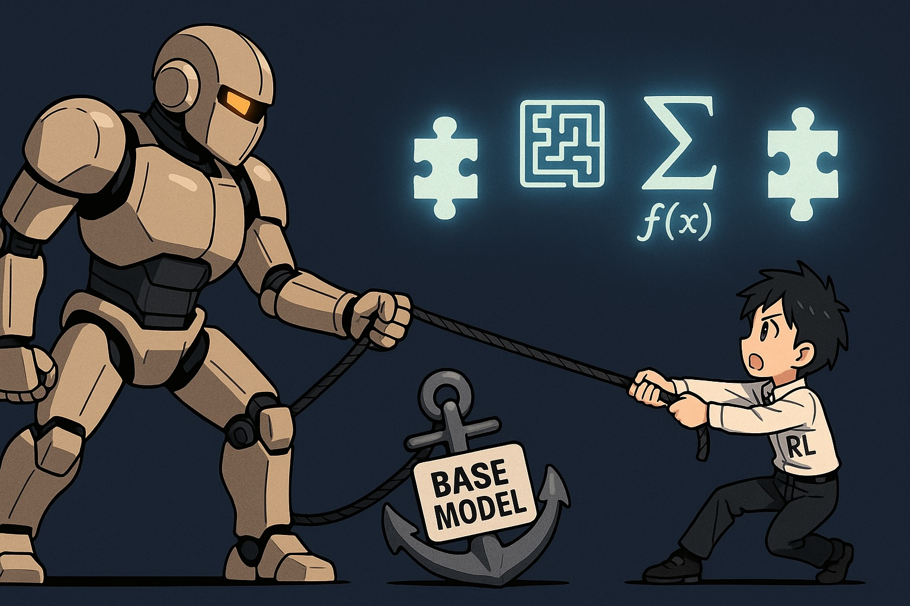

<!--  -->


# Awesome RLVR Reasoning Boundary
[](https://awesome.re)

A curated list of resources on Reinforcement Learning with Verifiable Rewards (RLVR) and the reasoning capability boundary of Large Language Models (LLMs).

## Contents

- [Overview](#overview)
- [Tag legend](#tag-legend)
- [Papers](#papers)
- [Contributing](#contributing)
- [Entry format](#entry-format)

## Overview

A central debate in recent research concerns whether reinforcement learning (RL) can endow models with reasoning abilities beyond those of their base model.

**The skeptical view.**
Limit of RLVR [[NeurIPS 2025]](https://arxiv.org/abs/2504.13837) argue that although RLVR-trained models outperform their base models at small \(k\) (e.g., \(k=1\)), the base models achieve equal or superior pass@k performance when \(k\) is large. Their coverage and perplexity analyses suggest that reasoning capabilities are ultimately bounded by the base model’s support. Similarly, [[arXiv:2507.14843]](https://arxiv.org/abs/2507.14843) provide a theoretical argument that RLVR cannot extend beyond the base model’s representational limits.

**The intuition behind the skepticism is:** 
Most RL-for-reasoning pipelines (GRPO/PPO variants) update the model by comparing rewards across multiple rollouts of the same prompt. If none of the rollouts solve the task (pass@K = 0), every sample is equally bad, so the gradients vanish.

**The optimistic view.**
In contrast, [[arXiv:2505.24864]](https://arxiv.org/abs/2505.24864)/[[arXiv:2507.12507]](https://arxiv.org/abs/2507.12507) demonstrate that ProRL can expand reasoning boundaries on tasks where the base model performs poorly—specifically in letter-formed 2D puzzles from Reasoning Gym. And [[arXiv:2509.21016]](https://www.arxiv.org/abs/2509.21016) further reveals a **grokking-like phase transition** after a long near-zero-reward plateau with a two-phase reward schedule, further providing evidence of RL’s potential in breaking the leash.

### **A call to study the hard frontier (pass@K = 0) problem families**
From these results emerges a critical challenge: how to find progress where base models truly fail. Many math and code benchmarks average performance over heterogeneous pools, in which the small fraction of genuinely hard instances (those with pass@K = 0 for strong pretrained models) is **washed out by easier cases**. Yet it is precisely on this “hard frontier” that the distinctive learning dynamics appear—most notably the grokking-like phase transitions that can require hundreds or thousands of RL updates per problem. We therefore argue that future study should explicitly isolate and track this subset, so that progress on truly novel reasoning is not obscured.

## Tag Legend


[//]: # (- ![Grokking]&#40;https://img.shields.io/badge/Grokking-%20-FB8C00?style=flat-square&#41;: Grokking phase detected)

- -%20-8A2BE2?style=flat-square): Provide evidence that the model can solve tasks where the base model had pass@k = 0. This is the **strong signal** that an RL can help tackle previously unsolvable problems.
- -%20-2E7D32?style=flat-square): Provide evidence of improved pass@k performance on tasks where the base model already had non-zero pass@k. Considered weaker evidence compared to the above, since the base model had some prior success. A larger K is considered more convincing. 
- : Indicates that the work was conducted on a controlled dataset or task, rather than on a mixed or heterogeneous pool. 
- : Optimism view.
- : Skepticism view.

(By pass@K, we typically refer to a $K\ge128$.)


💡 **Submission Guideline**: For pull requests to this list, we strongly recommend that papers provide direct evidence enabling the inclusion of either the **Pass@k (improved)** or **Pass@k (0 to 1)** tags. Methodology improvements focused solely on pass@1 are not considered pertinent to this topic.


## Papers

- **[[NeurIPS 2025]](https://arxiv.org/abs/2504.13837) Limit of RLVR: Does Reinforcement Learning Really Incentivize Reasoning Capacity in LLMs Beyond the Base Model?**  

  Authors: Yang Yue, Zhiqi Chen, Rui Lu, Andrew Zhao, Zhaokai Wang, Shiji Song, Gao Huang  
  Tags:   
  <details>
    <summary>Abstract</summary>
    Reinforcement Learning with Verifiable Rewards (RLVR) has recently demonstrated notable success in enhancing the reasoning performance of large language models (LLMs), particularly on mathematics and programming tasks. Similar to how traditional RL helps agents explore and learn new strategies, RLVR is believed to enable LLMs to continuously self-improve, thus acquiring novel reasoning abilities beyond those of the corresponding base models. In this study we critically examine the current state of RLVR by systematically probing the reasoning capability boundaries of RLVR-trained LLMs across various model families, RL algorithms, and math, coding, and visual reasoning benchmarks, using pass@k at large k values as the evaluation metric. Surprisingly, we find that the current training setup does not elicit fundamentally new reasoning patterns. While RLVR-trained models outperform their base models at small k (e.g., k = 1), the base models achieve a higher pass@k score when k is large. Coverage and perplexity analyses show that the observed reasoning abilities originate from and are bounded by the base model. Treating the base model as an upper bound, our quantitative analysis shows that six popular RLVR algorithms perform similarly and remain far from optimal in leveraging the potential of the base model. By contrast, we find that distillation can introduce new reasoning patterns from the teacher and genuinely expand the model's reasoning capabilities. Overall, our findings suggest that current RLVR methods have not yet realized the potential of RL to elicit truly novel reasoning abilities in LLMs. This highlights the need for improved RL paradigms, such as continual scaling and multi-turn agent-environment interaction, to unlock this potential.
  </details>

- **[[arXiv:2505.24864]](https://arxiv.org/abs/2505.24864) ProRL: Prolonged Reinforcement Learning Expands Reasoning Boundaries in Large Language Models**  
  Authors: Mingjie Liu, Shizhe Diao, Ximing Lu, Jian Hu, Xin Dong, Yejin Choi, Jan Kautz, Yi Dong  
  Tags:  -%20-2E7D32?style=flat-square)  
  <details>
    <summary>Abstract</summary>
    Recent advances in reasoning-centric language models have highlighted reinforcement learning (RL) as a promising method for aligning models with verifiable rewards. However, it remains contentious whether RL truly expands a model's reasoning capabilities or merely amplifies high-reward outputs already latent in the base model's distribution, and whether continually scaling up RL compute reliably leads to improved reasoning performance. In this work, we challenge prevailing assumptions by demonstrating that prolonged RL (ProRL) training can uncover novel reasoning strategies that are inaccessible to base models, even under extensive sampling. We introduce ProRL, a novel training methodology that incorporates KL divergence control, reference policy resetting, and a diverse suite of tasks. Our empirical analysis reveals that RL-trained models consistently outperform base models across a wide range of pass@k evaluations, including scenarios where base models fail entirely regardless of the number of attempts. We further show that reasoning boundary improvements correlates strongly with task competence of base model and training duration, suggesting that RL can explore and populate new regions of solution space over time. These findings offer new insights into the conditions under which RL meaningfully expands reasoning boundaries in language models and establish a foundation for future work on long-horizon RL for reasoning.
  </details>

- **[[arXiv:2507.14843]](https://arxiv.org/abs/2507.14843) The Invisible Leash: Why RLVR May or May Not Escape Its Origin** (arXiv 2025)  
  Authors: Fang Wu, Weihao Xuan, Ximing Lu, Mingjie Liu, Yi Dong, Zaid Harchaoui, Yejin Choi  
  Tags:   
  <details>
    <summary>Abstract</summary>
    Recent advances in LLMs highlight RLVR as a promising method for enhancing AI's capabilities, particularly in solving complex logical tasks. However, it remains unclear whether the current practice of RLVR truly expands a model's reasoning boundary or mainly amplifies high-reward outputs that the base model already knows for improved precision. This study presents an empirical investigation that provides fresh insights into the potential limits of the common practice of RLVR. We examine how, under current training conditions, RLVR can operate as a support-constrained optimization mechanism that may restrict the discovery of entirely original solutions, remaining constrained by the base model's initial distribution. We also identify an entropy-reward trade-off: while the current RLVR recipe reliably enhances precision, it may progressively narrow exploration and potentially overlook correct yet underrepresented solutions. Extensive empirical experiments validate that while the current RLVR recipe consistently improves pass@1, the shrinkage of empirical support generally outweighs the expansion of empirical support under larger sampling budgets, failing to recover correct answers that were previously accessible to the base model. Interestingly, we also observe that while RLVR sometimes increases token-level entropy — resulting in greater uncertainty at each generation step — answer-level entropy declines, indicating that these seemingly more uncertain paths ultimately converge onto a smaller set of distinct answers. Taken together, these findings reveal potential limits of the current RLVR recipe in extending reasoning horizons. Breaking this invisible leash may require future algorithmic innovations such as explicit exploration mechanisms or hybrid strategies that seed probability mass into underrepresented solution regions.
  </details>

- **[[arXiv:2507.12507]](https://arxiv.org/abs/2507.12507) Scaling Up RL: Unlocking Diverse Reasoning in LLMs via Prolonged Training**
  
  Authors: Mingjie Liu, Shizhe Diao, Jian Hu, Ximing Lu, Xin Dong, Hao Zhang, Alexander Bukharin, Shaokun Zhang, Jiaqi Zeng, Makesh Narsimhan Sreedhar, Gerald Shen, David Mosallanezhad, Di Zhang, Jonas Yang, June Yang, Oleksii Kuchaiev, Guilin Liu, Zhiding Yu, Pavlo Molchanov, Yejin Choi, Jan Kautz, Yi Dong  
  Tags:    
    <details>
    <summary>Abstract</summary>
    Recent advancements in reasoning-focused language models such as OpenAI's O1 and DeepSeek-R1 have shown that scaling test-time computation — through chain-of-thought reasoning and iterative exploration — can yield substantial improvements on complex tasks like mathematics and code generation. These breakthroughs have been driven by large-scale reinforcement learning (RL), particularly when combined with verifiable reward signals that provide objective and grounded supervision. In this report, we investigate the effects of prolonged reinforcement learning on a small language model across a diverse set of reasoning domains. Our work identifies several key ingredients for effective training, including the use of verifiable reward tasks, enhancements to Group Relative Policy Optimization (GRPO), and practical techniques to improve training stability and generalization. We introduce controlled KL regularization, clipping ratio, and periodic reference policy resets as critical components for unlocking long-term performance gains. Our model achieves significant improvements over strong baselines, including +14.7% on math, +13.9% on coding, and +54.8% on logic puzzle tasks. To facilitate continued research, we release our model publicly.
  </details>

- **[[arXiv:2507.13266]](https://arxiv.org/abs/2507.13266) QuestA: Expanding Reasoning Capacity in LLMs via Question Augmentation**

  Authors: Jiazheng Li, Hongzhou Lin, Hong Lu, Kaiyue Wen, Zaiwen Yang, Jiaxuan Gao, Yi Wu, Jingzhao Zhang  
  Tags:    
  <details>
    <summary>Abstract</summary>
    Reinforcement learning (RL) has emerged as a central paradigm for training large language models (LLMs) in reasoning tasks. Yet recent studies question RL's ability to incentivize reasoning capacity beyond the base model. This raises a key challenge: how can RL be adapted to solve harder reasoning problems more effectively? To address this challenge, we propose a simple yet effective strategy via Question Augmentation: introduce partial solutions during training to reduce problem difficulty and provide more informative learning signals. Our method, QuestA, when applied during RL training on math reasoning tasks, not only improves pass@1 but also pass@k-particularly on problems where standard RL struggles to make progress. This enables continual improvement over strong open-source models such as DeepScaleR and OpenMath Nemotron, further enhancing their reasoning capabilities. We achieve new state-of-the-art results on math benchmarks using 1.5B-parameter models: 72.50% (+10.73%) on AIME24, 62.29% (+12.79%) on AIME25, and 41.67% (+10.11%) on HMMT25. Code, data and model are available at this https URL.
  </details>
  
- **[[arxiv:2508.19201]](https://arxiv.org/pdf/2508.19201) Understanding Tool-Integrated Reasoning**

  Author: Heng Lin, Zhongwen Xu  
  Tags:  -%20-2E7D32?style=flat-square)   
  <details>
    <summary>Abstract</summary>
      We study why Tool-Integrated Reasoning (TIR) makes Large Language Models (LLMs) more capable. While LLMs integrated with tools like Python code interpreters show great promise, a principled theory explaining why this paradigm is effective has been missing. This work provides the first formal proof that TIR fundamentally expands an LLM's capabilities. We demonstrate that tools enable a strict expansion of the model's empirical and feasible support, breaking the capability ceiling of pure-text models by unlocking problem-solving strategies that are otherwise impossible or intractably verbose. To guide model behavior without compromising training stability and performance, we also introduce Advantage Shaping Policy Optimization (ASPO), a novel algorithm that directly modifies the advantage function to guide the policy behavior. We conduct comprehensive experiments on challenging mathematical benchmarks, leveraging a Python interpreter as the external tool. Our results show that the TIR model decisively outperforms its pure-text counterpart on the pass@k metric. Crucially, this advantage is not confined to computationally-intensive problems but extends to those requiring significant abstract insight. We further identify the emergent cognitive patterns that illustrate how models learn to think with tools. Finally, we report improved tool usage behavior with early code invocation and much more interactive turns with ASPO. Overall, our work provides the first principled explanation for TIR's success, shifting the focus from the mere fact that tools work to why and how they enable more powerful reasoning.
  </details>

- **[[arxiv:2508.14029]](https://arxiv.org/abs/2508.14029) Beyond Pass@1: Self-Play with Variational Problem Synthesis Sustains RLVR**

  Author: Xiao Liang, Zhongzhi Li, Yeyun Gong, Yelong Shen, Ying Nian Wu, Zhijiang Guo, Weizhu Chen 

  Tags:  -%20-2E7D32?style=flat-square)
  <details>
    <summary>Abstract</summary>
      Reinforcement Learning with Verifiable Rewards (RLVR) has recently emerged as a key paradigm for post-training Large Language Models (LLMs), particularly for complex reasoning tasks. However, vanilla RLVR training has been shown to improve Pass@1 performance at the expense of policy entropy, leading to reduced generation diversity and limiting the Pass@k performance, which typically represents the upper bound of LLM reasoning capability. In this paper, we systematically analyze the policy's generation diversity from the perspective of training problems and find that augmenting and updating training problems helps mitigate entropy collapse during training. Based on these observations, we propose an online Self-play with Variational problem Synthesis (SvS) strategy for RLVR training, which uses the policy's correct solutions to synthesize variational problems while ensuring their reference answers remain identical to the originals. This self-improving strategy effectively maintains policy entropy during training and substantially improves Pass@k compared with standard RLVR, sustaining prolonged improvements and achieving absolute gains of 18.3% and 22.8% in Pass@32 performance on the competition-level AIME24 and AIME25 benchmarks. Experiments on 12 reasoning benchmarks across varying model sizes from 3B to 32B consistently demonstrate the generalizability and robustness of SvS.
  </details>

- **[[arXiv:2509.21016]](https://www.arxiv.org/abs/2509.21016) DELTA-Code: How Does RL Unlock and Transfer New Programming Algorithms in LLMs?** | [Twitter](https://x.com/nouhadziri/status/1973457440294445165) | [Blog](https://accessible-dragon-75f.notion.site/RL-Grokking-Recipe-How-Can-We-Enable-LLMs-to-Solve-Previously-Unsolvable-Tasks-with-RL-100a1714e6778062bae5eafad8e7677d)

  Authors: Yiyou Sun, Yuhan Cao, Pohao Huang, Haoyue Bai, Hannaneh Hajishirzi, Nouha Dziri, Dawn Song  
  Tags:  -%20-8A2BE2?style=flat-square)     
  <details>
    <summary>Abstract</summary>
    It remains an open question whether LLMs can acquire or generalize genuinely new reasoning strategies, beyond the sharpened skills encoded in their parameters during pre-training or post-training. To attempt to answer this debate, we introduce DELTA-Code--Distributional Evaluation of Learnability and Transferrability in Algorithmic Coding, a controlled benchmark of synthetic coding problem families designed to probe two fundamental aspects: learnability -- can LLMs, through reinforcement learning (RL), solve problem families where pretrained models exhibit failure with large enough attempts (pass@K=0)? --and transferrability -- if learnability happens, can such skills transfer systematically to out-of-distribution (OOD) test sets? Unlike prior public coding datasets, DELTA isolates reasoning skills through templated problem generators and introduces fully OOD problem families that demand novel strategies rather than tool invocation or memorized patterns. Our experiments reveal a striking grokking phase transition: after an extended period with near-zero reward, RL-trained models abruptly climb to near-perfect accuracy. To enable learnability on previously unsolvable problem families, we explore key training ingredients such as staged warm-up with dense rewards, experience replay, curriculum training, and verification-in-the-loop. Beyond learnability, we use DELTA to evaluate transferability or generalization along exploratory, compositional, and transformative axes, as well as cross-family transfer. Results show solid gains within families and for recomposed skills, but persistent weaknesses in transformative cases. DELTA thus offers a clean testbed for probing the limits of RL-driven reasoning and for understanding how models can move beyond existing priors to acquire new algorithmic skills.
  </details>

- **[[Notion Blog]](https://spiffy-airbus-472.notion.site/What-Can-You-Do-When-You-Have-Zero-Rewards-During-RL-260429bdb7308024b6bdd3ed4f64c15f) What Can You Do When You Have Zero Rewards During RL?** | [Code](https://github.com/rl4reasoning/rl-baselines)

  Authors: Jatin Prakash*, Anirudh Buvanesh*  
  Tags:  -%20-8A2BE2?style=flat-square)    
  <details>
    <summary>Takeaway</summary>
    1) When the base model can’t solve a task at all (i.e., outcome rewards are always zero during RL training), we show that a *simple* data-centric intervention of adding easier instances of the same task in the training set works surprisingly well! 2) Choice of easy instances that you add matters! Adding only *very* easy examples doesn’t help. However, you don’t need to hunt for the “*perfect difficulty.*” Mixing all the easier instances you have works! 3) We benchmark methods that incorporate desirable components to tackle zero outcome rewards such as dense rewards, diversity incentives, and improved credit assignment, and find none of these to be effective in our settings. Since there was no official code for these baselines, we’re releasing (single-file, hackable) code for our implementation. Hopefully you’ll find it useful in your own experiments 4) We conclude with a simple and practical recipe for RL practitioners: add all available easier instances of the task that one can get their hands on! We also connect our findings to ideas in *skill* learning and related prior work.
  </details>
  
- **[[arXiv:2509.25666]](https://arxiv.org/abs/2509.25666) Nudging the Boundaries of LLM Reasoning** | [Twitter](https://x.com/cyjustinchen/status/1973423783374356491)

  Authors: Justin Chih-Yao Chen, Becky Xiangyu Peng, Prafulla Kumar Choubey, Kung-Hsiang Huang, Jiaxin Zhang, Mohit Bansal, Chien-Sheng Wu  
  Tags:  -%20-2E7D32?style=flat-square)  
  <details>
    <summary>Abstract</summary>
    Current online reinforcement learning (RL) algorithms like GRPO share a key limitation in LLM reasoning: they cannot learn from problems that are "unsolvable" to the model. In other words, they can only improve performance on problems where the model is capable of exploring the correct answer. Consequently, the model's "upper limit" remains unchanged after RL training, even though the likelihood of solving easier, solvable problems may increase. These hard samples cannot contribute to training, as no rollouts yield rewards and thus no gradients are produced. To unlock learning from these hard samples, we propose NuRL, a "nudging" method that aims to push the upper bound of LLM reasoning using self-generated hints, i.e., abstract cues that help reduce the problem difficulty for the model. Given a question and its gold answer, the model generates a CoT and then produces a hint containing the core knowledge needed to solve the problem. During training, we generate G rollouts from the base policy and use the pass rate to decide whether the hint should be injected. For hard samples with a 0% pass rate, we inject the hint and regenerate a new batch of trajectories. This yields two benefits: (1) the hint boosts pass rates (from 0% to non-zero), thereby introducing training signals for previously unsolvable samples, and (2) the hints are self-generated, avoiding distributional shift and do not rely on external models. NuRL achieves consistent improvements across 6 benchmarks and 3 models, while remaining complementary to test-time scaling. Notably, NuRL can raise the model's upper limit, whereas GRPO leaves pass@1024 unchanged from the base model. Furthermore, we present a systematic study of what makes an effective hint and when hints are most useful. Interestingly, the best hints are abstract and high-level, and are most beneficial when applied necessarily and after GRPO has converged.
  </details>

- **[[abXiv:2509.25849]](https://arxiv.org/abs/2509.25849v1) Knapsack RL: Unlocking Exploration of LLMs via Optimizing Budget Allocation**  | [Twitter](https://x.com/ZiniuLi/status/1973626847511585267)

  Authors: Ziniu Li, Congliang Chen, Tianyun Yang, Tian Ding, Ruoyu Sun, Ge Zhang, Wenhao Huang, Zhi-Quan Luo  
  Tags:    
  <details>
    <summary>Abstract</summary>
    Large Language Models (LLMs) can self-improve through reinforcement learning, where they generate trajectories to explore and discover better solutions. However, this exploration process is computationally expensive, often forcing current methods to assign limited exploration budgets to each task. This uniform allocation creates problematic edge cases: easy tasks consistently succeed while difficult tasks consistently fail, both producing zero gradients during training updates for the widely used Group Relative Policy Optimization (GRPO). We address this problem from the lens of exploration budget allocation. Viewing each task's exploration as an "item" with a distinct "value" and "cost", we establish a connection to the classical knapsack problem. This formulation allows us to derive an optimal assignment rule that adaptively distributes resources based on the model's current learning status. When applied to GRPO, our method increases the effective ratio of non-zero policy gradients by 20-40% during training. Acting as a computational "free lunch", our approach could reallocate exploration budgets from tasks where learning is saturated to those where it is most impactful. This enables significantly larger budgets (e.g., 93 rollouts) for especially challenging problems, which would be computationally prohibitive under a uniform allocation. These improvements translate to meaningful gains on mathematical reasoning benchmarks, with average improvements of 2-4 points and peak gains of 9 points on specific tasks. Notably, achieving comparable performance with traditional homogeneous allocation would require about 2x the computational resources.
  </details>

- **[[abXiv:2510.01180]](https://arxiv.org/pdf/2510.01180) BroRL: Scaling Reinforcement Learning via Broadened Exploration**

  Authors: Jian Hu, Mingjie Liu, Ximing Lu, Fang Wu, Zaid Harchaoui, Shizhe Diao, Yejin Choi, Pavlo Molchanov, Jun Yang, Jan Kautz, Yi Dong  
  Tags:    
  <details>
    <summary>Abstract</summary>
    Reinforcement Learning with Verifiable Rewards (RLVR) has emerged as a key ingredient for unlocking complex reasoning capabilities in large language models. Recent work ProRL has shown promise in scaling RL by increasing the number of training steps. However, performance plateaus after thousands of steps, with clear diminishing returns from allocating more computation to additional training. In this work, we investigate a complementary paradigm for scaling RL, BroR-Lincreasing the number of rollouts per example to hundreds to exhaustively Broaden exploration, which yields continuous performance gains beyond the saturation point observed in ProRL when scaling the number of training steps. Our approach is motivated by a mass balance equation analysis allowing us to characterize the rate of change in probability mass for correct and incorrect tokens during the reinforcement process. We show that under a one-step RL assumption, sampled rollout tokens always contribute to correct-mass expansion, while unsampled tokens outside rollouts may lead to gains or losses depending on their distribution and the net reward balance. Importantly, as the number of rollouts per example N increases, the effect of unsampled terms diminishes, ensuring overall correct-mass expansion. To validate our theoretical analysis, we conduct simulations under more relaxed conditions and find that a sufficiently large rollout size N-corresponding to ample exploration-guarantees an increase in the probability mass of all correct tokens. Empirically, BroRL revives models saturated after 3K ProRL training steps and demonstrates robust, continuous improvement, achieving state-of-the-art results for the 1.5B model across diverse benchmarks.
  </details>

- **[ICLR 2026 submission] The Reasoning Boundary Paradox: How Reinforcement Learning Constrains Language Models**  
  Paper: N/A (submission)  
  Tags:    
  <details>
    <summary>Abstract</summary>
    Reinforcement Learning with Verifiable Rewards (RLVR) has emerged as a key method for improving Large Language Models’ reasoning capabilities, yet recent evidence suggests it may paradoxically shrink the reasoning boundary rather than expand it. This paper investigates this shrinkage issue of RLVR by analyzing its learning dynamics and reveals two critical phenomena that explain this failure. First, we expose the negative interference phenomenon in RLVR, where learning to solve certain training problems actively reduces the likelihood of correct solutions for others, leading to the decline of Pass@k performance or the probability of generating a correct solution within k attempts. Second, we uncover the winner-take-all effect: RLVR disproportionately reinforces problems with high likelihood under the base model while suppressing initially low-likelihood, correct solutions. Through extensive theoretical and empirical analysis on multiple mathematical reasoning benchmarks, we show that this effect arises from the inherent on-policy sampling in standard RL objectives, causing the model to converge toward narrow solution strategies. Based on these insights, we propose a simple yet effective data curation algorithm that focuses RLVR learning on low-likelihood problems, achieving notable improvement in Pass@k performance.
  </details>
  
- **[ICLR 2026 submission] The Debate on RLVR Reasoning Capability Boundary: Shrinkage, Expansion, or Both? A Two-Stage Dynamic View** 
  <details>
    <summary>Abstract</summary>
    The ongoing debate on whether reinforcement learning with verifiable rewards (RLVR) expands or shrinks the reasoning capabilities of large language models (LLMs) remains unresolved. Some studies contend that RLVR mainly improves sampling efficiency but at the expense of diversity and exploratory capacity, resulting in capability boundary shrinkage. In contrast, others demonstrate that prolonged training can lead to the emergence of novel reasoning strategies, suggesting capability boundary expansion. To reconcile these contradictory findings, we theoretically and empirically show that both perspectives are partially valid—each aligning with a separate phase in an inherent two-stage probability mass dynamic: (1) Exploitation stage: initially, the model primarily samples explored high-reward and low-reward tokens, while rarely selecting the potentially optimal token. Positive advantage estimates increase the probability of high-reward tokens and decrease those of low-reward tokens, yet the optimal token’s probability remains largely unchanged during this stage. (2) Exploration stage: as training advances, the growth rate of previously acquired high-reward tokens slows as their probabilities approach saturation. When a potentially optimal token—now receiving positive advantage estimates—is occasionally sampled, its probability increases, while those of the originally high-reward tokens decrease. This dynamic suggests that over-exploitation during the exploitation stage may lead to capability boundary shrinkage, whereas prolonged training into the exploration stage can promote an expansion of the reasoning capability boundary. Building upon our insights, we revisit the potential of only using relative negative gradients for prolonging training, providing a theoretical and empirical foundation for the development of more advanced reasoning capabilities.
  </details>

- **[ICLR 2026 submission] Beyond Pass@k: Breadth-Depth Metrics for Reasoning Boundaries**  
  <details>
    <summary>Abstract</summary>
    Reinforcement Learning with Verifiable Rewards (RLVR) has emerged as a powerful paradigm to improve Large Language Models on reasoning tasks such as coding, math or logic. To assess the reasoning boundary (the fraction of problems a model can solve) researchers often report pass@k at large sampling budgets. Recent results reveal a crossover phenomenon: while RLVR models outperform the base model at small k values, the base model outperforms them when sampling a very large number of completions. This has been interpreted as evidence that base models have a larger reasoning boundary. We argue that on tasks with discrete answer spaces, such as math with numeric outputs, pass@k at large k reflects the increasingly higher chance of success in the limit of the number of trials rather than genuine reasoning, and can therefore be misleading. We propose cover@tau, which measures the fraction of problems that a model can solve for which at least a tau proportion of completions are correct. Unlike pass@k, cover@tau captures reasoning under an explicit reliability threshold: models that rely on random guessing degrade rapidly as tau increases. We evaluate several RLVR models using cover@tau-based metrics and illustrate how the relative rankings of popular algorithms change compared to pass@1, offering a different perspective on reasoning boundaries.
  </details>

## Contributing

PRs are welcome! Please group additions under the appropriate category and follow the entry format below. If a work fits multiple categories, pick the most salient and reference cross-links in the description if needed.

## Entry format

Use this structure for new entries:

```markdown
- **[[(Venue Year/Arxiv Tag]](https://arxiv.org/abs/xxxx.xxxxx) Paper Title** 
  
  Authors: First Last, ...  
  Tags: 
  <details>
    <summary>Abstract</summary>
    One-paragraph abstract.
  </details>
```
